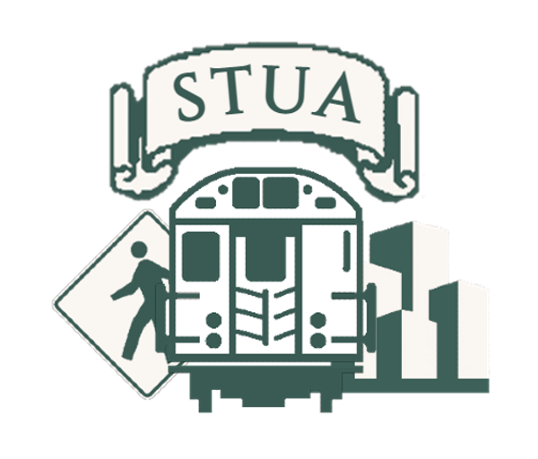

# STUA (Stuyvesant Transit and Urbanism) 
## The STUA Countdown Clock Project Module

---

If you are viewing this, I am assuming you came here to learn more about our countdown clock project for Stuyvesant High School. Started in the summer of 2019, the STUA has been trying to create some sort of display for the second floor TriBeCa bridge entrance. This display will display subway information and if possible, school club advertisements and other useful information. 

While the project has not been realized yet, we are hoping you could help us. This notebook contanis what we have gotten to so far. You are free to use the module for your own projects, or edit the core files of the module itself. If you code anything interesting you would like to bring to our attention, you can ping Irvin, Abheek, or I (Ravindra). 

Below is a little tutorial on how to use the module. Additionally, here are some hyperlinks to any part of this tutorial:

- [1. The MTA Google Transit API](#1)
- [2. Station Names and Station IDs](#2)
- [3. The GTFS class (NYCT)](#3)
- [4. The GTFS class (Bustime)](#4)
- [5. The GTFS class (LIRR)](#5)
- [6. The GTFS class (Metro-North)](#6)
- [7. The GTFS class (NYC Ferry)](#7)
- [8. setX()](#8)
- [9. Live Transit Alerts, alertsX()](#9)
- [10. sort()](#10)

---

## <a id =1> </a> 1. The MTA Google Transit API

The STUA gets it's data from the MTA Google Transit API, a realtime data formatter from Google that provides information on the locations of trains. Naturally, this means that using it we will be able to determine how far subway trains are from any station in the system. 

For whatever reason, this doesn't include the Staten Island Railway, so just keep a note of that. 

In order to access any information from the API, you will need an API key. To get one, follow the instructions on: 
[MTA Developer Resources](https://new.mta.info/developers)

In a new python file, you should have a heading in this general format. Copy the API key from the [MTA Developer Resources](https://new.mta.info/developers) website that you made in the previous step into the empty ```API``` string. 

```python
import stua 

#from mta.info
APImta = "NYCT"

#from bustime.mta.info
APIbustime = "BUSTIME"
```
## <a id =2> </a> 2. Station/Stop Names and Station/Stop IDs

The MTA internally orders it's stops are IDs, while we the general public see stations by their names. ```stua.convertX(String)``` converts a stop ID a it's respective stop name. 

```python
import stua 

APIMTA = "<insert key here>"
stua.keyMTA(APIMTA)

APIBustime = "<insert key here>"
stua.keyBUSTIME(APIBus)

station_id = "A36"
print(stua.convertSubway(station_id))

stop_id = "505130"
print(stua.convertBus(stop_id))

lirr_station_id = "73"
print(stua.convertLIRR(lirr_station_id))

mnr_station_id = "54"
print(stua.convertMNR(mnr_station_id))

ferry_stop_id = "90"
print(stua.convertFerry(ferry_stop_id))
```

## <a id =3> </a> 3. The GTFS Class (NYCT)

The goal of the STUA GTFS class is to gather GTFS for a specific station in an easy and efficient format. 

Upon initializing the class, the set method intakes a station ID and a direction, along with the position of the train you are looking for (1st incoming train, 2nd, 3rd, etc.). 

```object.route_id``` = returns the nearest route service<br>
```object.terminus``` = returns the name of the terminus station<br>
```object.terminus_id``` = returns the ID of the terminus station<br>
```object.station``` = returns the name of the current station<br>
```object.station_id``` = returns the ID of the current station<br> 
```object.direction``` = returns the direction being analyzed at the given station<br>
```object.service_pattern``` = returns which lines the given route runs on during normal service<br>
```object.service_description``` = returns when the given route runs during normal service<br>
```object.trip_id``` = returns the trip ID of the nearest incoming train<br>
```object.time``` = returns how far the nearest route service is<br> 

```python
import stua 

APIMTA = "<insert key here>"
stua.keyMTA(APIMTA)

train1 = stua.gtfsSubway()
train1.get("A51", "N", 1)
print(train1.terminus)
```

## <a id =4> </a> 4. The GTFS Class (Bustime)

Upon initializing the class, the set method intakes a stop ID and a direction (str), along with the position of the bus you are looking for (1st incoming bus, 2nd, 3rd, etc.). 

```object.route_id``` = returns the nearest route service<br>
```object.terminus``` = returns the name of the terminus stop<br>
```object.terminus_id``` = returns the ID of the terminus stop<br>
```object.stop``` = returns the name of the current stop<br>
```object.stop_id``` = returns the ID of the current stop<br> 
```object.direction``` = returns the direction being analyzed at the given stop<br>
```object.service_pattern``` = returns which lines the given route runs on during normal service<br>
```object.trip_id``` = returns the trip ID of the nearest incoming bus<br>
```object.time``` = returns how far the nearest route service is<br>
```object.vehicle``` = returns the bus number ID<br>

```python
import stua 

APIBUSTIME = "<insert key here>"
stua.keyBUSTIME(APIBUSTIME)

bus1 = stua.gtfsBus()
bus1.get("504204", 0, 1)
print(bus1.stop)
```

## <a id =5> </a> 5. The GTFS Class (LIRR)

Upon initializing the class, the set method intakes a stop ID and a direction (int), along with the position of the train you are looking for (1st incoming train, 2nd, 3rd, etc.). 

```object.route_id``` = returns the nearest route service<br>
```object.terminus``` = returns the name of the terminus station<br>
```object.terminus_id``` = returns the ID of the terminus station<br>
```object.station``` = returns the name of the current station<br>
```object.station_id``` = returns the ID of the current station<br> 
```object.direction``` = returns the direction being analyzed at the given station<br>
```object.service_pattern``` = returns which lines the given route runs on during normal service<br>
```object.service_description``` = returns when the given route runs during normal service<br>
```object.trip_id``` = returns the trip ID of the nearest incoming train<br>
```object.time``` = returns how far the nearest route service is<br> 
```object.vehicle``` = returns the leading car number of the train<br>
```object.station_id_list``` = returns the list of stations that this train will stop at, by ID<br>
```object.station_name_list``` = returns the list of stations that this train will stop at, by name<br>

```python
import stua 

APIMTA = "<insert key here>"
stua.keyMTA(APIMTA)

train1 = stua.gtfsLIRR()
train1.get("73", 1, 1)
print(train1.station_name_list)
```

## <a id =6> </a> 6. The GTFS Class (Metro-North)

Upon initializing the class, the set method intakes a stop ID and a direction (int), along with the position of the train you are looking for (1st incoming train, 2nd, 3rd, etc.). 

```object.route_id``` = returns the nearest route service<br>
```object.terminus``` = returns the name of the terminus station<br>
```object.terminus_id``` = returns the ID of the terminus station<br>
```object.station``` = returns the name of the current station<br>
```object.station_id``` = returns the ID of the current station<br> 
```object.direction``` = returns the direction being analyzed at the given station<br>
```object.service_pattern``` = returns which lines the given route runs on during normal service<br>
```object.service_description``` = returns when the given route runs during normal service<br>
```object.trip_id``` = returns the trip ID of the nearest incoming train<br>
```object.time``` = returns how far the nearest route service is<br> 
```object.vehicle``` = returns the leading car number of the train<br>
```object.station_id_list``` = returns the list of stations that this train will stop at, by ID<br>
```object.station_name_list``` = returns the list of stations that this train will stop at, by name<br>

```python
import stua 

APIMTA = "<insert key here>"
stua.keyMTA(APIMTA)

train1 = stua.gtfsMNR()
train1.get("90", 0, 3)
print(train1.vehicle)
```

## <a id =7> </a> 7. The GTFS Class (NYC Ferry)

Upon initializing the class, the set method intakes a stop ID, along with the position of the train you are looking for (1st incoming ferry, 2nd, 3rd, etc.). 

```object.route_id_SN``` = returns the nearest route service, in short name format<br>
```object.route_id_LN``` = returns the nearest route service, in full name format<br>
```object.terminus``` = returns the name of the terminus stop<br>
```object.terminus_id``` = returns the ID of the terminus stop<br>
```object.stop``` = returns the name of the current stop<br>
```object.stop_id``` = returns the ID of the current stop<br> 
```object.trip_id``` = returns the trip ID of the nearest incoming ferry<br>
```object.time``` = returns how far the nearest route service is<br> 
```object.vehicle``` = returns the ID given to this ferry<br>

```python
import stua 

#NYCFERRY does not require an API key

ferry1 = stua.gtfsFerry()
ferry1.get("88", 1)
print(ferry1.route_id_SN)
```

## <a id =8> </a> 8. setX()

STUA supports creating your own fictional data sets:<br>

```object.setSubway(route_id, terminus_id, station_id, direction, time, pattern, description, trip_id)```<br>

```object.setBus(route_id, terminus_id, stop_id, time, service_pattern, direction, trip_id, vehicle)```<br>

```object.setLIRR(route_id, terminus_id, station_id, direction, time, pattern, description, trip_id, station_id_list, vehicle)```<br>

```object.setMNR(route_id, terminus_id, station_id, direction, time, pattern, description, trip_id, station_id_list, vehicle)```<br>

```object.setFerry(route_id_SN, route_id_LN, terminus_id, stop_id, time, trip_id, vehicle)```

## <a id =9> </a> 9. Live Transit Alerts, alertsX()

STUA provides a set of methods for getting realtime transit alert data in a list format. Keys are required for this method (except NYCFERRY). Note that alertsBus() requires the MTA key, not the BUSTIME key.

```python
import stua 

APIMTA = "<insert key here>"

stua.keyMTA(APIMTA)

print(stua.alertsSubway())
print(stua.alertsBus())
print(stua.alertsLIRR())
print(stua.alertsMNR())
print(stua.alertsFerry())
```

## <a id =10> </a> 10. sort()

The STUA sort static method intakes a list of gtfs objects and sorts them based on their time field. The gtfs objects do not have to be the same forms of transit. 

```python
import stua

APIMTA = "<insert key here>"
APIBUSTIME = "<insert key here>"
stua.keyMTA(APIMTA)
stua.keyBUSTIME(APIBUSTIME)

train1 = stua.gtfsSubway()
train2 = stua.gtfsSubway()
ferry1 = stua.gtfsFerry()

train1.get("A51", "N", 1)
train2.get("A51", "S", 1)
ferry1.get("90", 1)

sorted = sort([train1, train2, ferry1])
print(sorted)
```